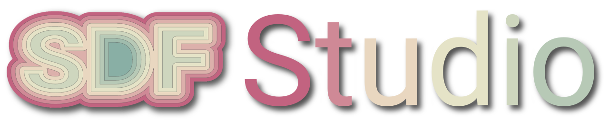
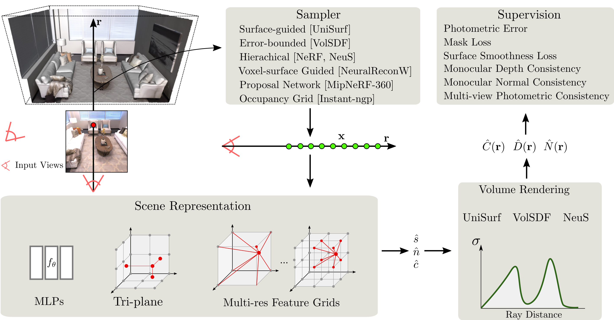
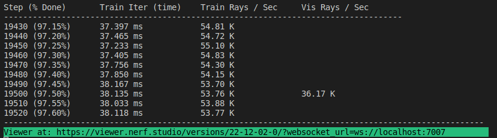
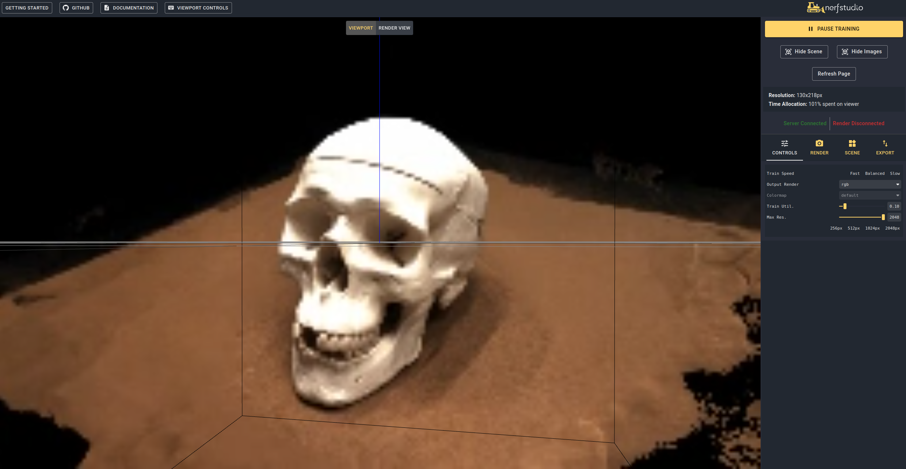
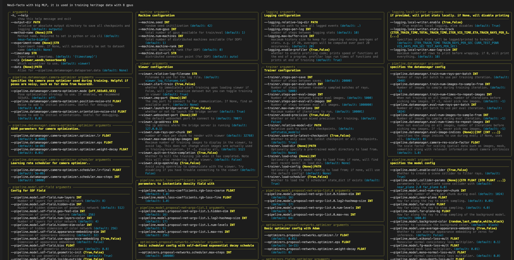

<p align="center">
    
    <h1 align="center">A Unified Framework for Surface Reconstruction</h1>
    <h3 align="center"><a href="https://autonomousvision.github.io/sdfstudio/">Project Page</a> | <a href="docs/sdfstudio-methods.md">Documentation</a> | <a href="docs/sdfstudio-data.md">Datasets</a> | <a href="docs/sdfstudio-examples.md">Examples</a> </h3>
    
</p>

# About

SDFStudio is a unified and modular framework for neural implicit surface reconstruction, built on top of the awesome nerfstudio project. We provide a unified implementation of three major implicit surface reconstruction methods: UniSurf, VolSDF, and NeuS. SDFStudio also supports various scene representions, such as MLPs, Tri-plane, and Multi-res. feature grids, and multiple point sampling strategies such as surface-guided sampling as in UniSurf, and Voxel-surface guided sampling from NeuralReconW. It further integrates recent advances in the area such as the utillization of monocular cues (MonoSDF), geometry regularization (UniSurf) and multi-view consistency (Geo-NeuS). Thanks to the unified and modular implementation, SDFStudio makes it easy to transfer ideas from one method to another. For example, Mono-NeuS applies the idea from MonoSDF to NeuS, and Geo-VolSDF applies the idea from Geo-NeuS to VolSDF.

# Updates
**2023.03.12**: Support [BakedSDF](https://bakedsdf.github.io/).

**2022.12.28**: Support [Neural RGB-D Surface Reconstruction](https://dazinovic.github.io/neural-rgbd-surface-reconstruction/).

# Quickstart

## 1. Installation: Setup the environment

SDFStudio is built on top of [nerfstudio](https://github.com/nerfstudio-project/nerfstudio). If you have already installed the nerfstudio environment, you can skip the following steps.

### Prerequisites

CUDA must be installed on the system. This library has been tested with version 11.3. You can find more information about installing CUDA [here](https://docs.nvidia.com/cuda/cuda-quick-start-guide/index.html).

### Create environment

SDFStudio requires `python >= 3.7`. We recommend using conda to manage dependencies. Make sure to install [Conda](https://docs.conda.io/en/latest/miniconda.html) before proceeding.

```bash
conda create --name sdfstudio -y python=3.8
conda activate sdfstudio
python -m pip install --upgrade pip
```

### Dependencies

Install pytorch with CUDA (this repo has been tested with CUDA 11.3) and [tiny-cuda-nn](https://github.com/NVlabs/tiny-cuda-nn)

```bash
pip install torch==1.12.1+cu113 torchvision==0.13.1+cu113 -f https://download.pytorch.org/whl/torch_stable.html
pip install git+https://github.com/NVlabs/tiny-cuda-nn/#subdirectory=bindings/torch
```

### Installing SDFStudio

```bash
git clone https://github.com/autonomousvision/sdfstudio.git
cd sdfstudio
pip install --upgrade pip setuptools
pip install -e .
# install tab completion
ns-install-cli
```

## 2. Train your first model

The following will train a _NeuS-facto_ model,

```bash
# Download some test data: you might need to install curl if your system don't have that
ns-download-data sdfstudio

# Train model on the dtu dataset scan65
ns-train neus-facto --pipeline.model.sdf-field.inside-outside False --vis viewer --experiment-name neus-facto-dtu65 sdfstudio-data --data data/sdfstudio-demo-data/dtu-scan65

# Or you could also train model on the Replica dataset room0 with monocular priors
ns-train neus-facto --pipeline.model.sdf-field.inside-outside True --pipeline.model.mono-depth-loss-mult 0.1 --pipeline.model.mono-normal-loss-mult 0.05 --vis viewer --experiment-name neus-facto-replica1 sdfstudio-data --data data/sdfstudio-demo-data/replica-room0 --include_mono_prior True
```

If everything works, you should see the following training progress:

<p align="center">
    
</p>

Navigating to the link at the end of the terminal will load the webviewer (developled by nerfstudio). If you are running on a remote machine, you will need to port forward the websocket port (defaults to 7007). With an RTX3090 GPU, it takes ~15 mins for 20K iterations but you can already see reasonable reconstruction results after 2K iterations in the webviewer.

<p align="center">
    
</p>

### Resume from checkpoint / visualize existing run

It is also possible to load a pretrained model by running

```bash
ns-train neus-facto sdfstudio-data --data data/sdfstudio-demo-data/dtu-scan65 --trainer.load-dir {outputs/neus-facto-dtu65/neus-facto/XXX/sdfstudio_models}
```

Note that this will automatically resume training. If you do not want to resume training, add `--viewer.start-train False` to your training command.

## 3. Exporting Results

Once you have a trained model you can export mesh and render the mesh.

### Extract Mesh

```bash
ns-extract-mesh --load-config outputs/neus-facto-dtu65/neus-facto/XXX/config.yml --output-path meshes/neus-facto-dtu65.ply
```

### Render Mesh

```
ns-render-mesh --meshfile meshes/neus-facto-dtu65.ply --traj interpolate  --output-path renders/neus-facto-dtu65.mp4 sdfstudio-data --data data/sdfstudio-demo-data/dtu-scan65
```

You will get the following video if everything works properly.

https://user-images.githubusercontent.com/13434986/207892086-dd6cae89-7271-4904-9163-6a9bfec49a12.mp4

### Render Video

First we must create a path for the camera to follow. This can be done in the viewer under the "RENDER" tab. Orient your 3D view to the location where you wish the video to start, then press "ADD CAMERA". This will set the first camera key frame. Continue to new viewpoints adding additional cameras to create the camera path. We provide other parameters to further refine your camera path. Once satisfied, press "RENDER" which will display a modal that contains the command needed to render the video. Kill the training job (or create a new terminal if you have lots of compute) and the command to generate the video.

To view all video export options run:

```bash
ns-render --help
```

## 4. Advanced Options

### Training models other than NeuS-facto

We provide many other models than NeuS-facto, see [the documentation](docs/sdfstudio-methods.md). For example, if you want to train the original NeuS model, use the following command:

```bash
ns-train neus --pipeline.model.sdf-field.inside-outside False sdfstudio-data --data data/sdfstudio-demo-data/dtu-scan65
```

For a full list of included models run `ns-train --help`. Please refer to the [documentation](docs/sdfstudio-methods.md) for a more detailed explanation for each method.

### Modify Configuration

Each model contains many parameters that can be changed, too many to list here. Use the `--help` command to see the full list of configuration options.

**Note, that order of parameters matters! For example, you cannot set `--machine.num-gpus` after the `--data` parameter**

```bash
ns-train neus-facto --help
```

<details>
<summary>[Click to see output]</summary>



</details>

### Tensorboard / WandB

Nerfstudio supports three different methods to track training progress, using the viewer, [tensorboard](https://www.tensorflow.org/tensorboard), and [Weights and Biases](https://wandb.ai/site). These visualization tools can also be used in SDFStudio. You can specify which visualizer to use by appending `--vis {viewer, tensorboard, wandb}` to the training command. Note that only one may be used at a time. Additionally the viewer only works for methods that are fast (ie. `NeuS-facto` and `NeuS-acc`), for slower methods like `NeuS-facto-bigmlp`, use the other loggers.

## 5. Using Custom Data

Please refer to the [datasets](docs/sdfstudio-data.md) and [data format](https://github.com/autonomousvision/sdfstudio/blob/master/docs/sdfstudio-data.md#Dataset-format) documentation if you like to use custom datasets.

# Built On

<a href="https://github.com/nerfstudio-project/nerfstudio">
<!-- pypi-strip -->
<picture>
    <source media="(prefers-color-scheme: dark)" srcset="https://docs.nerf.studio/en/latest/_images/logo.png" />
<!-- /pypi-strip -->
    
<!-- pypi-strip -->
</picture>
<!-- /pypi-strip -->
</a>

- A collaboration friendly studio for NeRFs
- Developed by [nerfstudio team](https://github.com/nerfstudio-project)

<a href="https://github.com/brentyi/tyro">
<!-- pypi-strip -->
<picture>
    <source media="(prefers-color-scheme: dark)" srcset="https://brentyi.github.io/tyro/_static/logo-dark.svg" />
<!-- /pypi-strip -->
    
<!-- pypi-strip -->
</picture>
<!-- /pypi-strip -->
</a>

- Easy-to-use config system
- Developed by [Brent Yi](https://brentyi.com/)

<a href="https://github.com/KAIR-BAIR/nerfacc">
<!-- pypi-strip -->
<picture>
    <source media="(prefers-color-scheme: dark)" srcset="https://user-images.githubusercontent.com/3310961/199083722-881a2372-62c1-4255-8521-31a95a721851.png" />
<!-- /pypi-strip -->
    
<!-- pypi-strip -->
</picture>
<!-- /pypi-strip -->
</a>

- Library for accelerating NeRF renders
- Developed by [Ruilong Li](https://www.liruilong.cn/)

# Citation

If you use this library or find the documentation useful for your research, please consider citing:

```bibtex
@misc{Yu2022SDFStudio,
    author    = {Yu, Zehao and Chen, Anpei and Antic, Bozidar and Peng, Songyou Peng and Bhattacharyya, Apratim 
                 and Niemeyer, Michael and Tang, Siyu and Sattler, Torsten and Geiger, Andreas},
    title     = {SDFStudio: A Unified Framework for Surface Reconstruction},
    year      = {2022},
    url       = {https://github.com/autonomousvision/sdfstudio},
}
```
