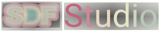

<p align="center">
    
    <h1 align="center">A Unified Framework for Surface Reconstruction</h1>
    <h3 align="center"><a href="https://niujinshuchong.github.io/monosdf/">Project Page</a> | <a href="https://arxiv.org/abs/2206.00665">Documentation</a> | <a href="https://arxiv.org/abs/2206.00665">Data</a>  </h3>
    
</p>

# About

SDF-Studio is a unified and modularized framework for neural implicit surface reconstruction, built on top of the awesome nerfstudio project. We provide unified implementation of three major implicit surface reconstruction methods: UniSurf, VolSDF, and NeuS. SDF-Studio also supports various scene representions, such as MLPs, Tri-plane, and Multi-res. feature grids, and multiple points sampling strategy such as surface-guided sampling as in UniSurf, and Voxel-surface guided sampling from NeuralReconW. It further integrated recent advances in the area such as monocular prior in MonoSDF and multi-view consistency in Geo-NeuS. Thanks to the unified and modularized implementation, we could apply idea from one method to the other methods easily. For example, Mono-NeuS applies the idea from MonoSDF to NeuS, and Geo-VolSDF applies the idea from Geo-NeuS to VolSDF.

# Quickstart

## 1. Installation: Setup the environment

SDFStudio is built on top of Nerfstudio. If you already install environment of nerfstudio, it should work out of box for SDFStudio.
### Prerequisites

CUDA must be installed on the system. This library has been tested with version 11.3. You can find more information about installing CUDA [here](https://docs.nvidia.com/cuda/cuda-quick-start-guide/index.html)

### Create environment

SDFStudio requires `python >= 3.7`. We recommend using conda to manage dependencies. Make sure to install [Conda](https://docs.conda.io/en/latest/miniconda.html) before proceeding.

```bash
conda create --name sdfstudio -y python=3.8
conda activate sdfstudio
python -m pip install --upgrade pip
```

### Dependencies

Install pytorch with CUDA (this repo has been tested with CUDA 11.3) and [tiny-cuda-nn](https://github.com/NVlabs/tiny-cuda-nn)

```bash
pip install torch==1.12.1+cu113 torchvision==0.13.1+cu113 -f https://download.pytorch.org/whl/torch_stable.html
pip install git+https://github.com/NVlabs/tiny-cuda-nn/#subdirectory=bindings/torch
```

### Installing SDFStudio

```bash
git clone https://github.com/autonomousvision/sdfstudio.git
cd sdfstudio
pip install --upgrade pip setuptools
pip install -e .
```

## 2. Train your first model!

The following will train a _NeuS-facto_ model,

```bash
# Download some test data: you might need to install curl if your system don't have that
ns-download-data sdfstudio

# Train model on the dtu dataset scan65
ns-train neus-facto --pipeline.model.sdf-field.inside-outside False --vis viewer --experiment-name neus-facto-dtu65 sdfstudio-data --data data/sdfstudio-demo-data/dtu-scan65

# Or you could also train model on the Replica dataset room0 with monocular priors
ns-train neus-facto --pipeline.model.sdf-field.inside-outside True --pipeline.model.mono-depth-loss-mult 0.1 --pipeline.model.mono-normal-loss-mult 0.05 --vis viewer --experiment-name neus-facto-replica1 sdfstudio-data --data data/sdfstudio-demo-data/replica-room0 --include_mono_prior True
```

If everything works, you should see training progress like the following:

<p align="center">
    
</p>

Navigating to the link at the end of the terminal will load the webviewer (developled by nerfstudio). If you are running on a remote machine, you will need to port forward the websocket port (defaults to 7007). With an RTX3090 GPU, it takes ~15 mins for 20K iterations but you can already see reasonable reconstruction results after 2K iterations in the webviewer. 

<p align="center">
    
</p>

### Resume from checkpoint / visualize existing run

It is possible to load a pretrained model by running

```bash
ns-train neus-facto sdfstudio-data --data data/sdfstudio-demo-data/dtu-scan65 --trainer.load-dir {outputs/neus-facto-dtu65/neus-facto/XXX/sdfstudio_models}
```

This will automatically start training. If you do not want it to train, add `--viewer.start-train False` to your training command.

## 3. Exporting Results

Once you have a trained model you can either render out a video or export a point cloud.

### Extract Mesh
```bash
ns-extract-mesh --load-config outputs/neus-facto-dtu65/neus-facto/XXX/config.yml --output-path meshes/neus-facto-dtu65.ply
```

### Render Mesh
```
ns-render-mesh --meshfile meshes/neus-facto-dtu65.ply --traj interpolate --data.data data/sdfstudio-demo-data/dtu-scan65 --output-path renders/neus-facto-dtu65.mp4
```

### Render Video

First we must create a path for the camera to follow. This can be done in the viewer under the "RENDER" tab. Orient your 3D view to the location where you wish the video to start, then press "ADD CAMERA". This will set the first camera key frame. Continue to new viewpoints adding additional cameras to create the camera path. We provide other parameters to further refine your camera path. Once satisfied, press "RENDER" which will display a modal that contains the command needed to render the video. Kill the training job (or create a new terminal if you have lots of compute) and the command to generate the video.

Other video export options are available, learn more by running,

```bash
ns-render --help
```

## 4. Advanced Options

### Training models other than neus-facto

We provide other models than neus-facto, for example if you want to train the original neus model, use the following command,

```bash
ns-train neus --pipeline.model.sdf-field.inside-outside False sdfstudio-data --data data/sdfstudio-demo-data/dtu-scan65
```

For a full list of included models run `ns-train --help`. Please refer to xxx for more detailed explaination for each methods

### Modify Configuration

Each model contains many parameters that can be changed, too many to list here. Use the `--help` command to see the full list of configuration options.

```bash
ns-train neus-facto --help
```

### Tensorboard / WandB

We support three different methods to track training progress, using the viewer, [tensorboard](https://www.tensorflow.org/tensorboard), and [Weights and Biases](https://wandb.ai/site). You can specify which visualizer to use by appending `--vis {viewer, tensorboard, wandb}` to the training command. Note that only one may be used at a time. Additionally the viewer only works for methods that are fast (ie. nerfacto, instant-ngp), for slower methods like NeRF, use the other loggers.

## 5. Using Custom Data

We supports all 
Using an existing dataset is great, but likely you want to use your own data! We support various methods for using your own data. Before it can be used in nerfstudio, the camera location and orientations must be determined and then converted into our format using `ns-process-data`. We rely on external tools for this, instructions and information can be found in the documentation.

| Data                                                                                              | Requirements     | Preprocessing Speed |
| ------------------------------------------------------------------------------------------------- | ---------------- | ------------------- |
| 📷 [Images](https://docs.nerf.studio/en/latest/quickstart/custom_dataset.html#images-or-video)    | COLMAP           | 🐢                  |
| 📹 [Video](https://docs.nerf.studio/en/latest/quickstart/custom_dataset.html#images-or-video)     | COLMAP           | 🐢                  |
| 📱 [Polycam](https://docs.nerf.studio/en/latest/quickstart/custom_dataset.html#polycam-capture)   | LiDAR iOS Device | 🐇                  |
| 📱 [Record3D](https://docs.nerf.studio/en/latest/quickstart/custom_dataset.html#record3d-capture) | LiDAR iOS Device | 🐇                  |
| 🖥 [Metashape](https://docs.nerf.studio/en/latest/quickstart/custom_dataset.html#metashape)        |                  | 🐢                  |
| 🛠 [Custom](https://docs.nerf.studio/en/latest/quickstart/data_conventions.html)                   | Poses            | 🐇                  |


# Built On

<a href="https://github.com/nerfstudio-project/nerfstudio">
<!-- pypi-strip -->
<picture>
    <source media="(prefers-color-scheme: dark)" srcset="https://docs.nerf.studio/en/latest/_images/logo-dark.png" />
<!-- /pypi-strip -->
    
<!-- pypi-strip -->
</picture>
<!-- /pypi-strip -->
</a>

- A collaboration friendly studio for NeRFs 
- Developed by [nerfstudio team](https://github.com/nerfstudio-project)

<a href="https://github.com/brentyi/tyro">
<!-- pypi-strip -->
<picture>
    <source media="(prefers-color-scheme: dark)" srcset="https://brentyi.github.io/tyro/_static/logo-dark.svg" />
<!-- /pypi-strip -->
    
<!-- pypi-strip -->
</picture>
<!-- /pypi-strip -->
</a>

- Easy-to-use config system
- Developed by [Brent Yi](https://brentyi.com/)

<a href="https://github.com/KAIR-BAIR/nerfacc">
<!-- pypi-strip -->
<picture>
    <source media="(prefers-color-scheme: dark)" srcset="https://user-images.githubusercontent.com/3310961/199083722-881a2372-62c1-4255-8521-31a95a721851.png" />
<!-- /pypi-strip -->
    
<!-- pypi-strip -->
</picture>
<!-- /pypi-strip -->
</a>

- Library for accelerating NeRF renders
- Developed by [Ruilong Li](https://www.liruilong.cn/)

# Citation

If you use this library or find the documentation useful for your research, please consider citing:

```bibtex
@misc{Yu2022SDFStudio,
  author    = {Zehao Yu, Anpei Chen, Bozidar Antic, Songyou Peng, Apratim Bhattacharyya,
               Michael Niemeyer, Siyu Tang Torsten Sattler and Andreas Geiger},
  title     = {SDFStudio: A Unified Framework for Surface Reconstruction},
  year      = {2022},
  url       = {https://github.com/autonomousvision/sdfstudio},
}
```